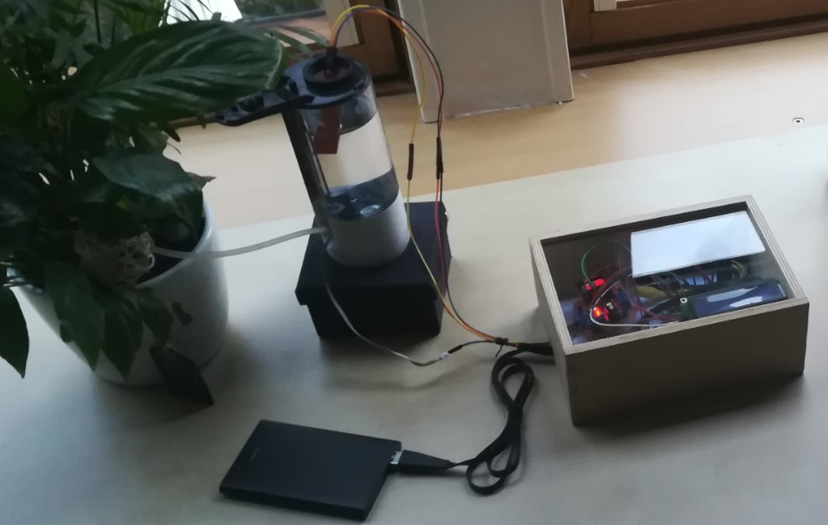

# IOT - watering plant system connected to the web and with alerts

This is a project I made for a school assignment in which an old soap dispenser is reconverted into a water source for a plant. It uses a NodeMCU, the equivalent of an Arduino with an integrated ESP8266 WiFi microchip.

The circuit/layout can be found inside the 'Pictures' folder.

## Features

- Multiple sensors for humidity, temperature and water level
- DC motor to pump the water
- LCD screen for "quick glance" information
- WiFi connection to send the data to a Cayenne Dashboard (MQTT) and a Discord server (HTTPS)
- Uses a DISCORD webhook to receive alerts with a @usermention, such as when the water level is below a certain threshold
- Uses the Cayenne online dashboard for a quick and easy visual reference of the many sensor values

